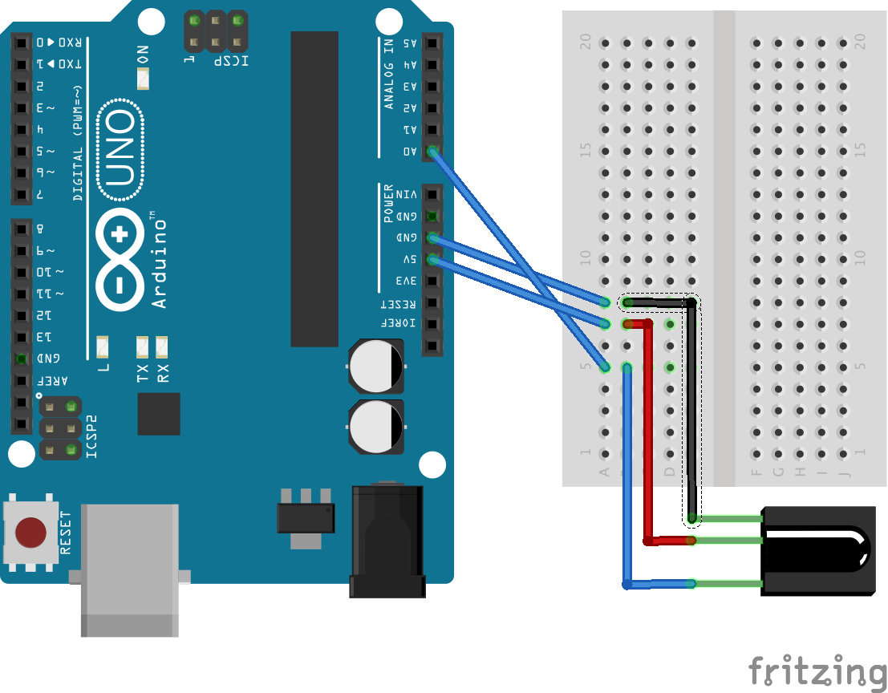
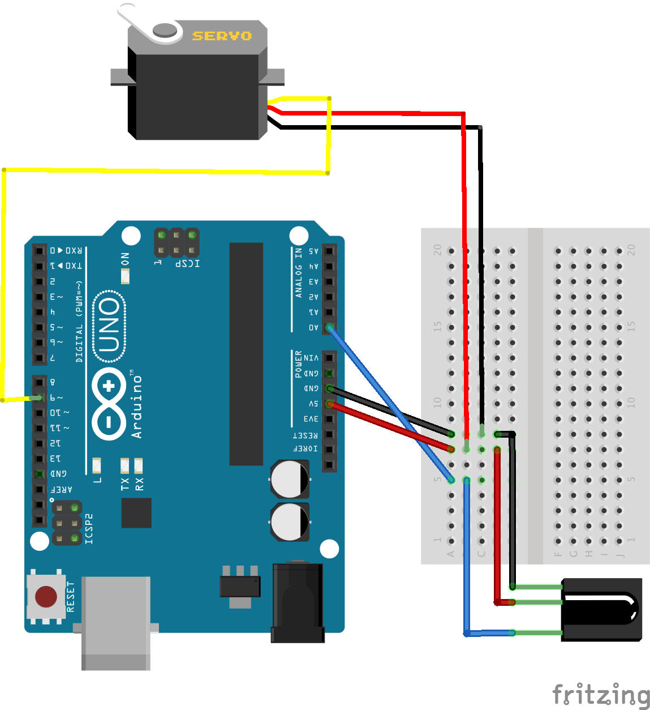

Read the Wand ID and shake magnitude of a MagiQuest wand, using an Arduino and IR sensor.

```sh
Comms enabled - beginning sensing
wand_id: 683915009
magnitude: 33114
wand_id: 683915009
magnitude: 33114
wand_id: 809765633
magnitude: 383
wand_id: 809765633
magnitude: 33278
```

# MagiQuest Wand "hello world"

## Parts List

*Hardware*:

 * Arduino Uno
 * IR Receiver (I used an [OSEPP IR Receiver Module](https://www.osepp.com/electronic-modules/sensor-modules/66-ir-receiver-module), [AdaFruit IR Receiver Sensor](https://www.adafruit.com/products/157) should also work)
 * MagiQuest Wand

*Software - Arduino IR Support*:

 1. Arduino -> Sketch -> IRRemote
 
*Or if IR support isn't alrady installed*:

 1. or Arduino -> Sketch -> Include Library -> Manage Libraries...
 2. search IRRemote
 3. Install
 
## Wiring it up




# Basic Project - Servo and MagiQuest

The `magi-spin` project is a basic example of using a MagiQuest wand to control a servo. In repsonse to a wand wave, a
servo will quickly swing back and forth.

## Parts List

*Hardware*:

 * Arduino Uno
 * IR Receiver (I used an [OSEPP IR Receiver Module](https://www.osepp.com/electronic-modules/sensor-modules/66-ir-receiver-module), [AdaFruit IR Receiver Sensor](https://www.adafruit.com/products/157) should also work)
 * Servo (I used an [Adafruit Micro Servo](https://www.adafruit.com/products/169))
 * MagiQuest wand

*Software - Arduino IR Support*:

 1. Arduino -> Sketch -> IRRemote
 
*Or if IR support isn't alrady installed*:

 1. or Arduino -> Sketch -> Include Library -> Manage Libraries...
 2. search IRRemote
 3. Install
 
## Wiring Diagram



## Code

See [magi-spin source](magi-spin/magi-spin.ino)

# Decoding MagiQuest

A breakdown of the [signal characteristics of a MagiQuest Wand](http://openschemes.com/2013/03/13/mq-widget-part-iii/) is available over at OpenSchemes. Instead of hand decoding the entire IR signal, we piggyback on the IRremote Arduino library, with a few modifications courtesy of [mpflaga's MagiQuest fork of IRremote](https://github.com/mpflaga/Arduino-IRremote).

We lifted the MagiQuest specific code from *mpflaga* and, with a few changes, directly included the relevant decode functions
in the Arduino Sketch. The function of interest is *decodeMagicQuest*, which is called with a pointer to an `IRremote::decode_results` structure,
and the `magiquest` structure we declare at the top of the sketch. Calling the *decodeMagiQuest* will decode and fill in the
data in both the `decode_results` and `magiquest` structures:

```c
decodeMagiQuest(&results, &data);

// the wand id is also in results.value
Serial.print("wand_id: ");
Serial.println(data.cmd.wand_id);

Serial.print("magnitude: ");
Serial.println(data.cmd.magnitude);
```

